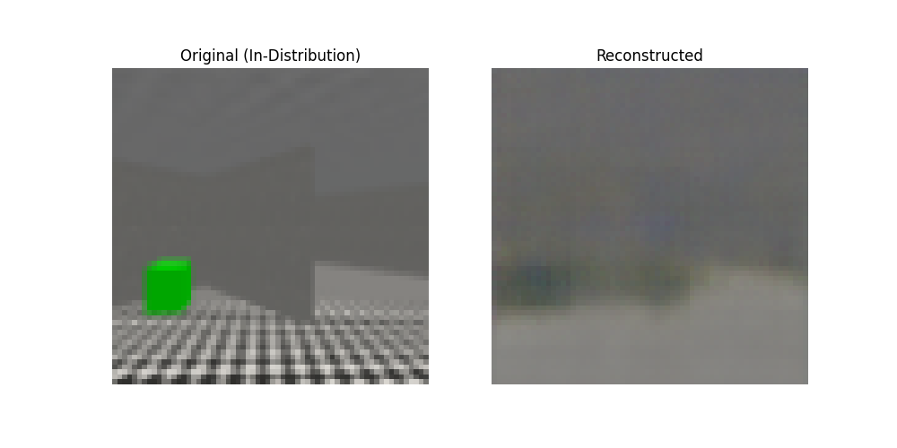
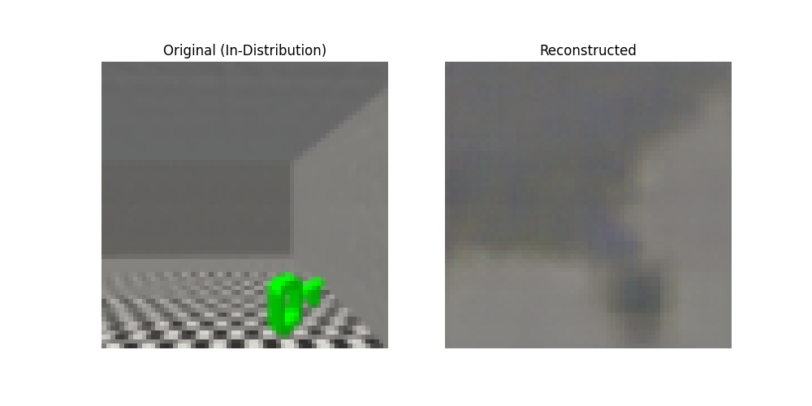
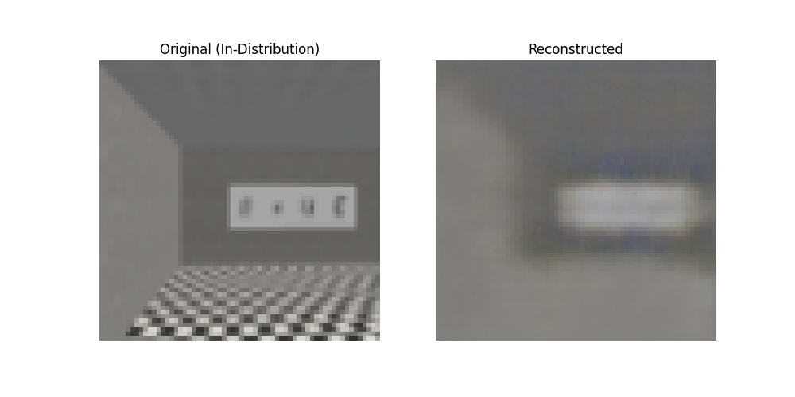
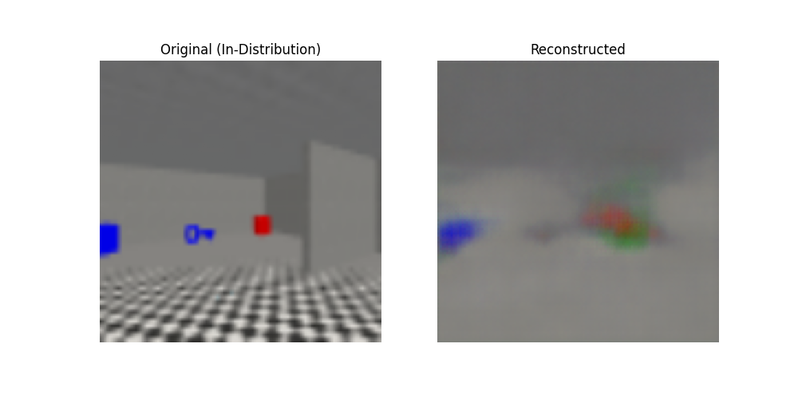
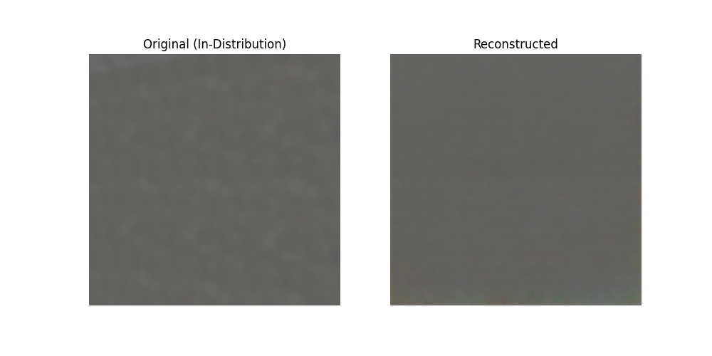
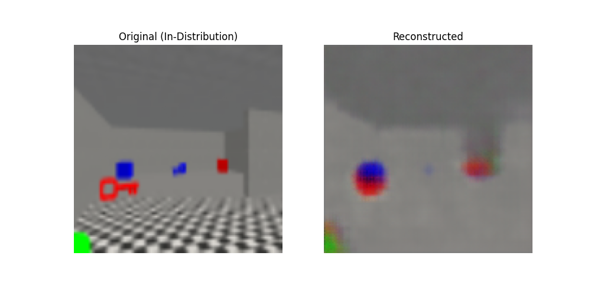
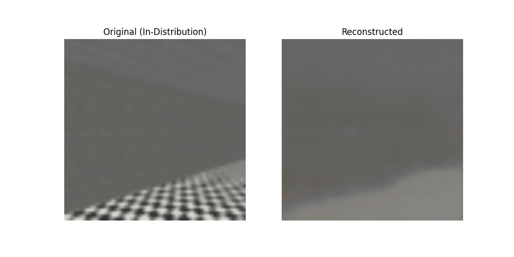
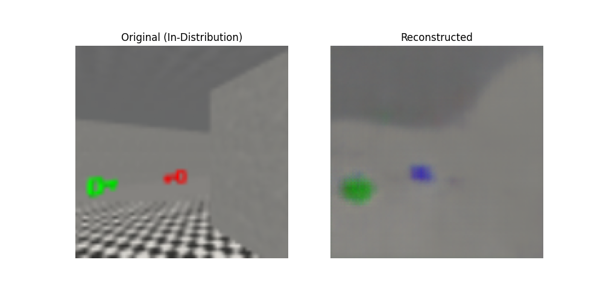
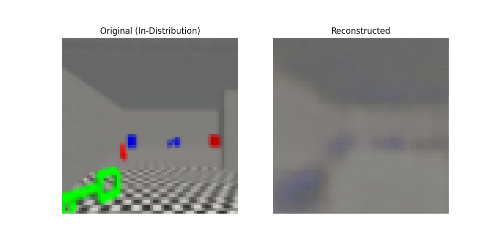

# Just me coding to learn world models

The implementation takes heavy inspiration from *Ha, D., & Schmidhuber, J. (2018). World models. arXiv preprint arXiv:1803.10122, 2(3).*

A few twitches make this implementation different from PhD.Ha's work:
- PyTorch instead of Tensorflow.
- Train/validate on MiniWorld environments.
- Use GRU instead of RNN for the memory model.
- Totally different vision model, memory model and controller model, because I'm just playing around.

## Some results
### Vision model

